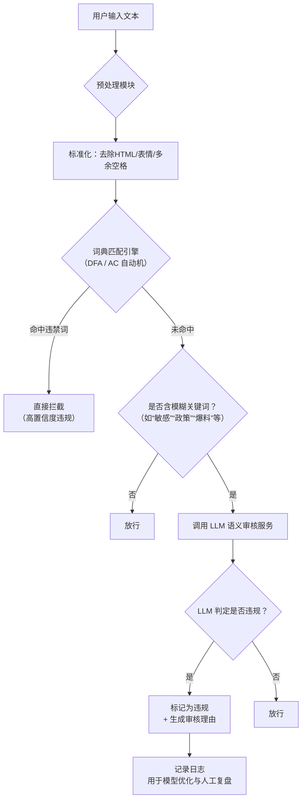

# **混合式自媒体违禁词检测方案文档**

## 一、整体流程架构



---

## 二、详细处理流程

### Step 1：文本预处理
- 清洗输入：移除 HTML 标签、Emoji、URL、连续空格等
- 输出标准化纯文本

### Step 2：词典匹配（第一道防线）
- **词库来源**：
  - 基础违禁词库（政治、暴恐、色情、赌博等）
  - 平台自定义词库（如品牌保护词、社区黑话）
**匹配算法**：AC 自动机
**命中处理**：
  - 若匹配到高危词（如“枪支”“毒品”“封杀”），**直接拦截**
  - 若匹配到中性词（如“敏感”“政治”），**不拦截，但标记为“需语义复核”**

> ✅ **优势**：90%+ 明确违规内容在此阶段被快速过滤，响应 < 10ms。

### Step 3：模糊关键词过滤（触发 LLM）
- 维护一个**模糊关键词白名单**（用于触发 LLM 审核）：
  ```js
  const fuzzyKeywords = ['敏感', '爆料', '懂的都懂', '老板', '政策', '没人管', '背后', '真相', '建议别...'];
  ```
- 若文本包含任一模糊词，则进入 LLM 审核流程。
- **目的**：避免对所有文本调用 LLM，控制成本与延迟。

### Step 4：LLM 语义审核（第二道防线）
- **模型选型**：Qwen-7B-Chat
- **调用方式**：通过 HTTP API 调用 Prompt 推理服务
- **核心 Prompt 设计**（Few-shot + 结构化输出）：

```text
你是一个专业的内容安全审核员，请根据以下规则判断用户输入是否违规：

【审核规则】
1. 禁止散布未经证实的负面信息（如企业/个人谣言）
2. 禁止使用隐晦语言进行人身攻击、煽动对立或制造恐慌
3. 禁止以反讽、暗示、影射等方式传播违规内容
4. 中性词在合理语境下不视为违规（如“这篇文章很敏感”是正常描述）

【输出格式】
请严格按以下 JSON 格式回答，不要包含其他内容：
{
  "is_violation": true/false,
  "violation_type": "谣言/人身攻击/煽动对立/其他/无",
  "confidence": 0.0 ~ 1.0,
  "reason": "简要说明判断依据"
}

【用户输入】
{用户文本}

【你的回答】
```

- **示例输入**：  
  `"建议大家别买XX品牌的车，听说他们老板干过不少见不得人的事，具体我就不说了，懂的都懂。"`

- **预期输出**：
  ```json
  {
    "is_violation": true,
    "violation_type": "谣言",
    "confidence": 0.96,
    "reason": "在无事实依据的情况下，暗示企业负责人存在不当行为，属于散布未经证实的负面信息。"
  }
  ```

### Step 5：决策与输出
| LLM 输出 | 系统动作 |
|--------|--------|
| `is_violation: true` 且 `confidence ≥ 0.8` | 自动拦截，返回提示：“内容不符合社区规范” |
| `is_violation: true` 且 `0.5 ≤ confidence < 0.8` | 标记为“高风险”，进入人工复审队列 |
| `is_violation: false` 或 `confidence < 0.5` | 放行 |

### Step 6：日志与反馈闭环
- 记录：原始文本、词典匹配结果、LLM 输入/输出、最终决策
- 每日分析：LLM 误判/漏判案例，用于优化 Prompt 或补充词库
- 支持人工复审结果回流，驱动未来微调或规则更新